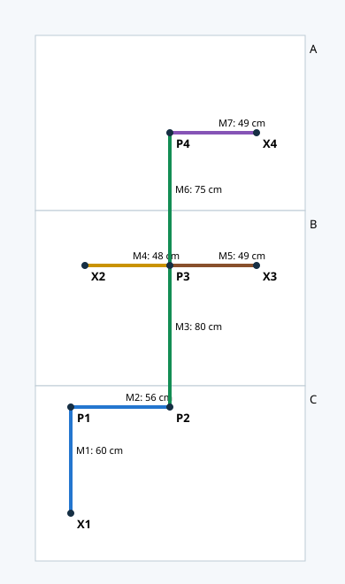
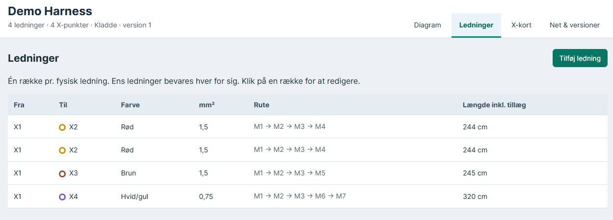
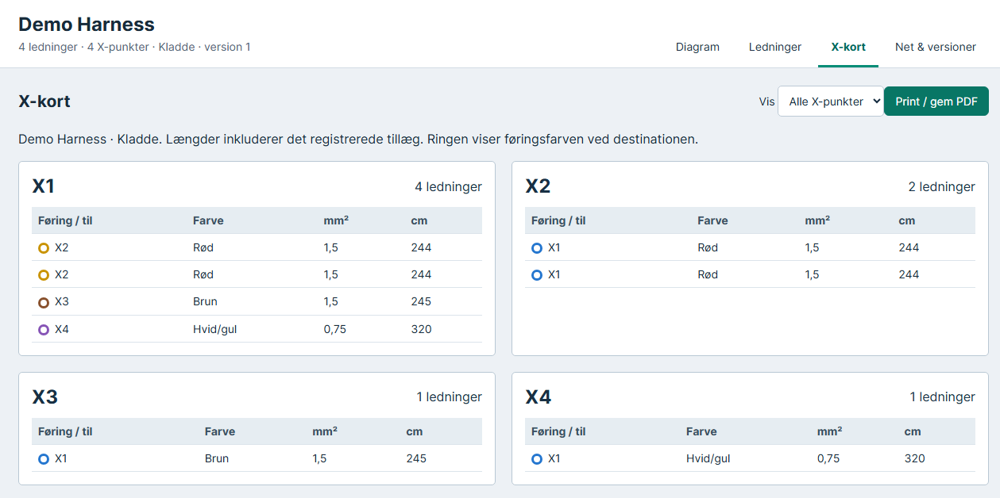
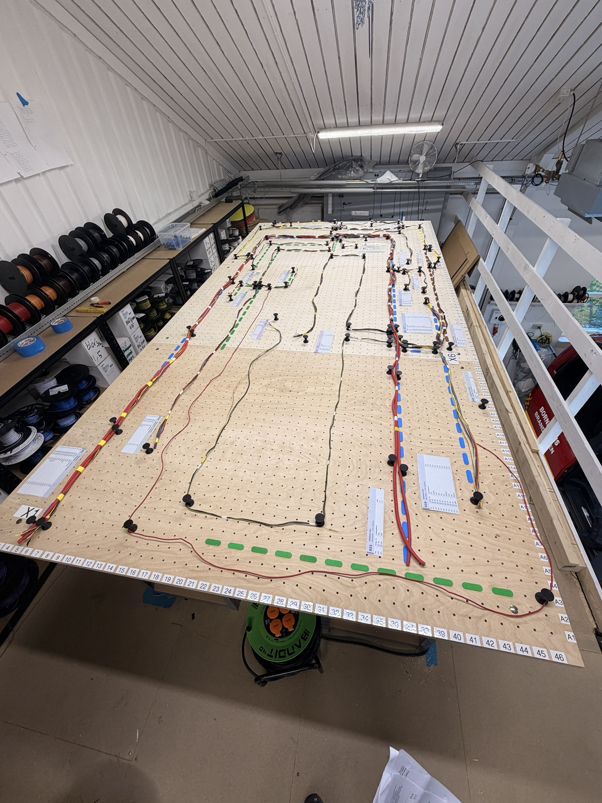
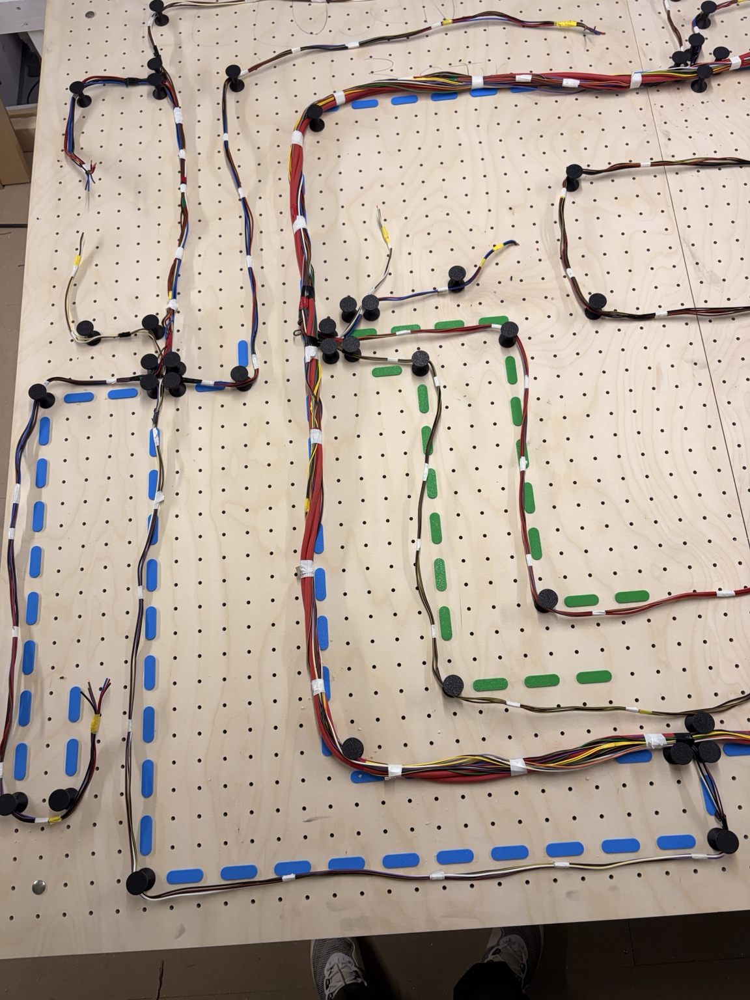

# Harness Studio: Wiring Harness Design and Assembly Documentation

**A Python and SQLite application for planning wire routes, calculating wire lengths and generating printable assembly cards.**

## About the project

A wiring harness is a group of electrical wires routed together to connect components in a vehicle or machine. Building one requires clear records of where each wire starts and ends, its length and how it should be positioned on the assembly board.

Harness Studio brings that information into one editable application. Users can adjust the routing diagram, record measurements and wire specifications, and produce endpoint control cards from the same data. The goal is to make harness documentation easier to correct and reuse for the next build.

I developed this prototype after carrying out the manual harness-building process myself at Lindeberg Tech, including measuring, routing, assembly and connection checks. Working at the board helped me identify what the software needed to show and how someone in the workshop would use it.

**Technical focus:** Python · SQLite · JavaScript · SVG · Data modelling · Graph traversal · Workflow automation

**Project status:** Working local prototype. The included dataset is synthetic so visitors can explore the software without using a customer harness specification. The application and existing screenshots use Danish; this project documentation is in English.



*Diagram generated from the included demo data. This is a layout illustration, not a screenshot of the editor.*

## Application screenshots

These screenshots show the Danish interface using the synthetic Demo Harness.

### Wire list



*One row per physical wire, including separate rows for identical wires. Each record shows its endpoints, wire colour, cross-section, route and calculated length including the registered allowance.*

### Endpoint control cards



*Printable cards grouped by X-point. The coloured ring indicates the routing colour at the destination. Cards are derived from the current wire records and measurements.*

## Why I built it

I carried out the manual process of measuring, routing, assembling, documenting and checking wiring harnesses. That experience highlighted an opportunity to keep routing diagrams, measurements and control cards together so they can be corrected and reused.

Harness Studio is a prototype for that workflow: select a harness, edit its physical layout and wire records, then generate updated endpoint cards from the same data.

## From the workshop

The photos below show the real hands-on work behind this project. They document the physical assembly process; the downloadable application uses a separate, synthetic demo harness.

### Assembly-board overview



*Wire routing on the assembly board, with numbered hole coordinates, coloured guides and printed endpoint cards.*

### Routing detail



*Close-up of the manual routing and assembly work: bundles and branches are held in position by movable pegs.*

## Features

- Editable SVG diagram with draggable points, bends, zoom and search.
- Assembly-board hole grid with 32 mm centre spacing and named coordinates.
- Separate records for physical routing segments and individual electrical wires.
- Breadth-first route suggestions between wire endpoints.
- Wire-length calculation from entered segment measurements and a per-wire allowance.
- Validation of route continuity, endpoint consistency and missing measurements.
- Automatically updated, printable X-point cards with destination route colours.
- SQLite storage, saved revision history, JSON import/export and undo for unsaved edits.
- Version checks to reject stale saves from another browser tab.

## Quick start

Requires Python 3.10 or newer. No third-party Python packages or database server are required.

1. Download or clone this repository.
2. Open a terminal in the project folder.
3. Run:

```sh
python server.py
```

On Windows, you can also double-click `START_WINDOWS.bat`.

The application opens at http://127.0.0.1:8765. Keep the terminal open while working. If the port is occupied, use `python server.py --port 8766`.

On first launch, a new database is created at `data/harness.sqlite` using `seed.json`. Changing the seed does not overwrite an existing database.

## Try the demo

1. Open **Demo Harness** and choose **Kopiér** to make your own working copy.
2. Search for **M1**. Its measured length is 60 cm.
3. Change it to 65 cm and click **Anvend**. Each demo wire uses M1, so each calculated length increases by 5 cm.
4. Open **X-kort** to see the updated control cards.
5. Return to **Diagram**, select a point and drag it. Its position changes, but the entered measured lengths remain unchanged.
6. Choose **Gem ændringer** to persist your edits.

| Danish control | Meaning |
| --- | --- |
| Nyt / Kopiér | New harness / copy harness |
| Søg | Find a point or segment |
| Lås til huller / Til hul | Snap dragged points / snap selected point |
| Anvend | Apply an edit in the current session |
| Gem ændringer | Save to the database |
| Ledninger | Individual wire records |
| Foreslå rute | Suggest a connected route |
| X-kort | Endpoint control cards |
| Net & versioner | Harness settings and saved history |
| Print / gem PDF | Print cards or save them as PDF |

## How it works

The browser holds the current editable document. Python validates saved documents and writes the harness and revision snapshot in a SQLite transaction. Control cards are derived from the current wire records and segment measurements.

The database uses six tables: `harness`, `point`, `segment`, `wire`, `route_step` and `revision`. Route steps are ordered; duplicate physical wires are retained as separate records.

A route suggestion uses breadth-first search and minimises the number of segments, **not total distance**. It is a suggestion to check against the physical board. Editing a connection does not automatically reroute existing wires.

Measured length and drawn geometry are deliberately separate. Moving a point cannot silently overwrite a tape-measured value. A routing point also does not imply an electrical splice.

Combined measurements are supported when two or more segments have only a shared known length. A route using only part of that group remains unresolved until the required individual measurements are provided.

## Tests

```sh
python -m unittest discover -v
```

Tests cover measured lengths, allowances, persistence, revision history, stale saves, atomic validation failures, route errors, combined measurements and duplicate wires. They do not constitute browser interaction tests.

## Project files

| File | Purpose |
| --- | --- |
| `server.py` | Local HTTP API, validation, length calculation and SQLite persistence |
| `static/` | JavaScript, HTML and CSS interface |
| `seed.json` | Synthetic starter harness |
| `test_app.py` | Automated regression tests |
| `docs/demo-layout.svg` | Illustration of the synthetic layout |

## Current scope

This is a local prototype, not a deployed production platform. It binds to localhost and has no user accounts. The fixed board is 152.5 × 297 cm across three plates. Physical hole positions and routing must be checked before workshop use. The original production workflow includes manual connection checks; the application does not perform electrical certification or current-capacity calculations.

The UI calculates results in JavaScript for immediate feedback; Python separately validates them on save. Keeping those implementations aligned is an ongoing maintenance consideration.

## Backup

Use **Eksportér JSON** to transfer the current harness. For all harnesses and revision history, close the program and back up `data/harness.sqlite`. Local databases are excluded from Git.

## Possible next steps

- Browser-level interaction tests and improved keyboard accessibility.
- Configurable board dimensions and calibrated peg positions.
- An English interface and a clearer first-use workflow.
- Comparison of measured geometry with entered lengths.
- Optional OCR-assisted data entry with human confirmation.

These are future ideas, not implemented features. The current route suggestions and calculations are deterministic algorithms, not machine learning.
